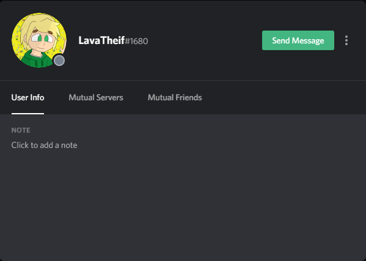
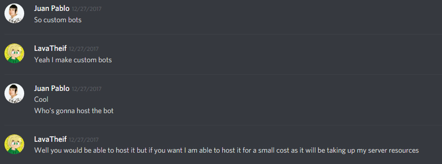

# About

Hi my name is Isidro and I'm a kinda new developer. I begun to make simple HTML5 websites when I was in 6th grade ~~I think~~. I never really put that much time or thought about programming until I was 15. I started to learn Node.js in august? I don't remember when but I did. Since then I've been make Discord bots using the discord.js library. I still was very new in programming in JavaScript ~~I still am as of 8/1/18~~ and had problems making the most simple command, until I found LavaTheif or Charlie. To be honest I paid him to make a bot which was called Juanbot and I used the code source for my own projects. I don't know why I didn't use google/github for examples for my needs. 

  
I found Lava in a discord advertisement server in December of 2017, he and I were talking about the bot I wanted and how he was code it and all. We've been friends since then I'd reckon. Now It's August and we've now are "partners"\(?\) in crime we could say. He is truly a great guy I'd love to keep this relationship in the coming future.

  
Well this about page has become more about a story so I guess this is my adventure in the programming field.

Original post `8/1/18` .

